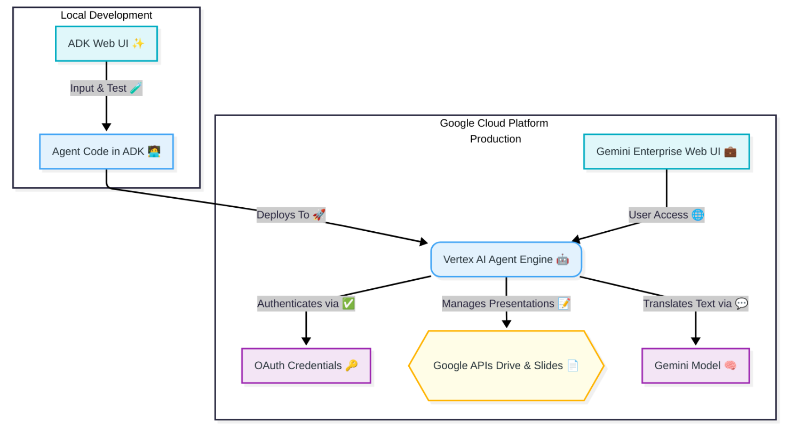
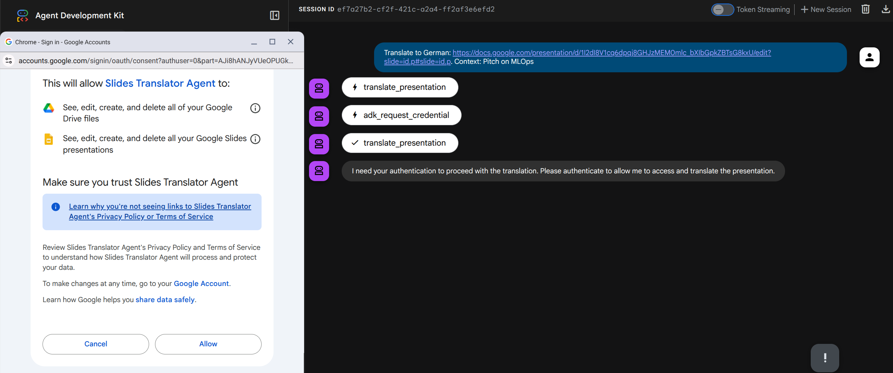
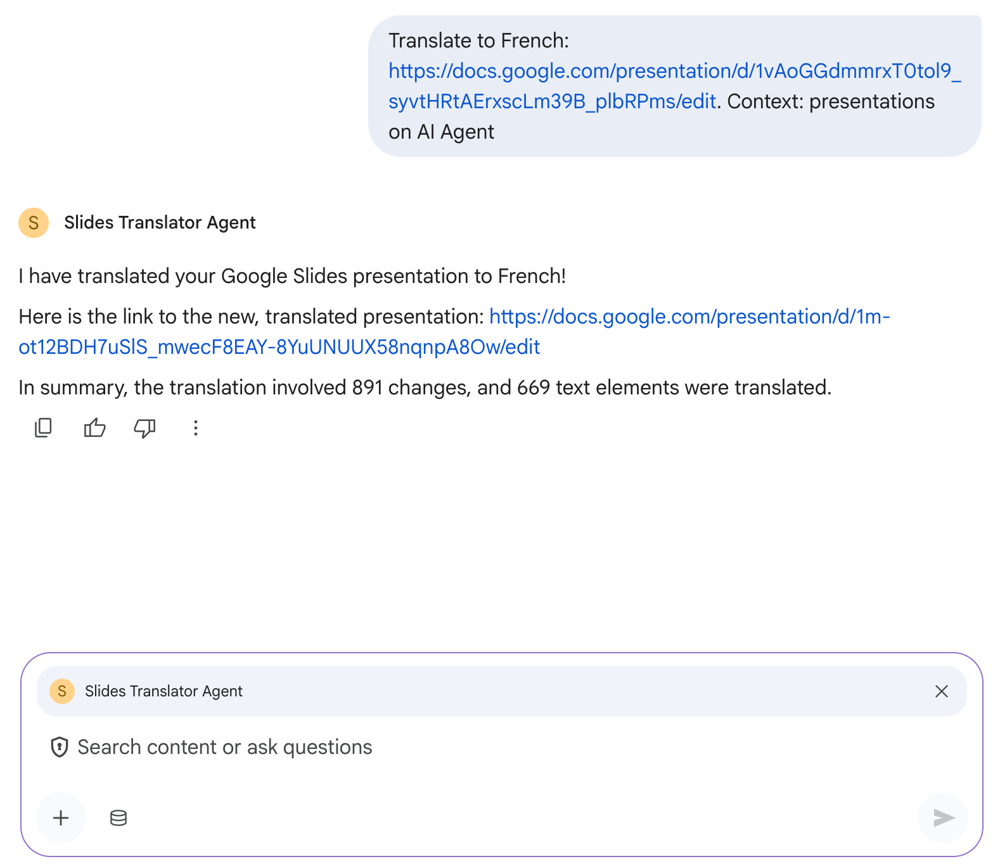
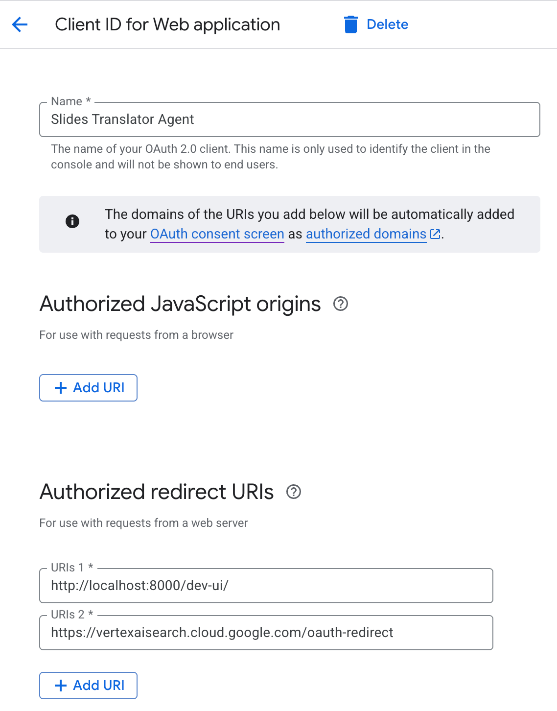

# Slides Translator Agent

[](https://github.com/fmind/slides-translator-agent/actions/workflows/ci.yml)
[](https://github.com/fmind/slides-translator-agent/blob/main/LICENSE.txt)
[](https://github.com/fmind/slides-translator-agent/releases)

**Slides Translator** is an AI-powered agent designed to automatically translate the content of a Google Slides presentation into a specified language.

It leverages Large Language Models (LLMs) through the Google AI platform and uses the Google Drive and Google Slides APIs to read the original presentation and create a translated copy.

## 🏛️ Architecture



The agent is developed locally using the **[ADK (Agent Development Kit)](https://google.github.io/agent-development-kit/)** and its web UI for testing.

Once ready, the agent code is deployed to the **[Vertex AI Agent Engine](https://cloud.google.com/vertex-ai)** in the [Google Cloud Platform](https://cloud.google.com/) for production use.

In the production environment:

- Users interact with the agent through the **[Gemini Enterprise](https://cloud.google.com/gemini-enterprise)**.
- The **[Vertex AI Agent Engine](https://cloud.google.com/vertex-ai)** orchestrates the workflow.
- It authenticates using **[OAuth Credentials](https://developers.google.com/identity/protocols/oauth2)** to access Google Workspace APIs.
- It interacts with **[Google Drive API](https://developers.google.com/drive/api)** and **[Google Slides API](https://developers.google.com/slides/api)** to read the original presentation and create a translated copy.
- It leverages a **[Gemini Model](https://deepmind.google/technologies/gemini/)** to perform the text translation.

## ✨ Features

- **Google Slides & Drive Integration:** Securely authenticates with Google services using OAuth2 to access presentations.
- **Automated Presentation Copying:** Creates a new, translated version of the presentation in your Google Drive, preserving the original.
- **Content Translation:** Extracts and translates all text elements within the slides.
- **Context-Awareness:** Allows users to provide additional context (e.g., "this is a technical presentation") to improve translation quality.
- **Agent-based Architecture:** Built using the `google-adk` framework for a modular and robust design.
- **Configurable:** Allows setting the underlying LLM models for the agent and translation tasks via environment variables.
- **Concurrent Operations:** Utilizes concurrent workers for faster text translation and slide updates.

## 🖼️ Screenshots

Here are a few screenshots of the Slides Translator Agent in action:

**1. [ADK Web UI](https://github.com/google/adk-web) (development):**



**2. [Gemini Enterprise](https://cloud.google.com/gemini-enterprise) (production):**



## ⚙️ Setup & Installation

1. **Clone the repository:**

    ```bash
    git clone https://github.com/fmind/slides-translator-agent
    cd slides-translator-agent
    ```

2. **Install project and hooks:**
    This project uses `just` as a command runner and `uv` for package management.

    ```bash
    just install
    ```

3. **Create an environment file:**
    Copy the example environment file and fill in the required values.

    ```bash
    cp .env.example .env
    ```

    You will need to populate variables in the `.env` file from your GCO project.

## 🔑 Authentication

This project requires two layers of authentication:

1. **Google Cloud (for Generative AI):**
    Ensure you have authenticated your environment for Google Cloud access. This typically involves:
    - Installing the Google Cloud CLI (`gcloud`).
    - Running `just cloud-auth` to login and update your Application Default Credentials.
    - Ensuring the following APIs are enabled in your Google Cloud project (you can use `just cloud-services` to enable them):
        - AI Platform API (`aiplatform.googleapis.com`)
        - Cloud Build API (`cloudbuild.googleapis.com`)
        - Cloud Run API (`run.googleapis.com`)

2. **Google Workspace (for Slides & Drive):**
    The agent needs to act on your behalf to read and create presentations. This is done via OAuth 2.0.
    - You must create an **OAuth 2.0 Client ID** in your Google Cloud project.
    - When creating the credential, configure a redirect URI for the web UI, e.g., `http://localhost:8000/dev-ui`.
    - Once created, copy the **Client ID** and **Client Secret** into the `AUTHENTICATION_CLIENT_ID` and `AUTHENTICATION_CLIENT_SECRET` variables in your `.env` file.
    - Make sure the **Google Drive API** and **Google Slides API** are enabled for your project.



## 🔧 Configuration

The application uses environment variables for configuration (defined in `.env`):

- `GOOGLE_CLOUD_PROJECT`: Your Google Cloud project ID.
- `AUTHENTICATION_CLIENT_ID`: Your OAuth 2.0 Client ID.
- `AUTHENTICATION_CLIENT_SECRET`: Your OAuth 2.0 Client Secret.
- `MODEL_NAME_AGENT`: The agent's LLM model (defaults to `gemini-2.5-flash`).
- `MODEL_NAME_TRANSLATION`: The translation task's LLM model (defaults to `gemini-1.5-flash`).
- `LOGGING_LEVEL`: Sets the logging level (e.g., `INFO`, `DEBUG`).
- `GOOGLE_CLOUD_LOCATION`: The GCP region for the agent (defaults to `global`).
- `CONCURRENT_TRANSLATION_WORKERS`: Number of concurrent workers for translation (defaults to `10`).
- `CONCURRENT_SLIDES_BATCH_UPDATES`: Number of slide updates to batch together (defaults to `50`).
- `TOKEN_CACHE_KEY`: The key used to cache the user's OAuth token in the tool state (defaults to `user:slides_translator_token`).

## 🚀 Commands

This project uses `just` as a command runner. Here are the available commands:

### Agent

- **`just agent`**: Run the agent's web UI locally.
- **`just agent-web [log_level]`**: Serve the agent's web UI with a specific log level.
- **`just agent-deploy`**: Deploy the agent to Google Cloud Run and Agent Engine.
- **`just agent-requirements`**: Export agent requirements to `requirements.txt`.

### Cloud

- **`just cloud`**: Run all cloud tasks (authentication and settings).
- **`just cloud-auth`**: Authenticate to Google Cloud.
- **`just cloud-services`**: Enable required Google Cloud services.
- **`just cloud-settings`**: Configure Google Cloud project settings.
- **`just cloud-storage`**: Create a Google Cloud Storage bucket.

### Checks

- **`just check`**: Run all checks (lock, code, type, format).
- **`just check-code`**: Check code quality with Ruff.
- **`just check-format`**: Check code formatting with Ruff.
- **`just check-lock`**: Check if `uv.lock` is up to date.
- **`just check-type`**: Check code types with `ty`.

### Formatting

- **`just format`**: Run all formatters.
- **`just format-import`**: Format imports with Ruff.
- **`just format-source`**: Format source code with Ruff.

### Installation

- **`just install`**: Install the project and Git hooks.
- **`just install-hooks`**: Install Git hooks.
p*   **`just install-project`**: Sync project dependencies with `uv`.

### Cleaning

- **`just clean`**: Clean all temporary files.
- **`just clean-lock`**: Remove `uv.lock`.
- **`just clean-python`**: Remove Python cache files.
- **`just clean-ruff`**: Remove the Ruff cache.
- **`just clean-venv`**: Remove the virtual environment.

## 📄 License

This project is licensed under the MIT License - see the LICENSE.txt file for details.
